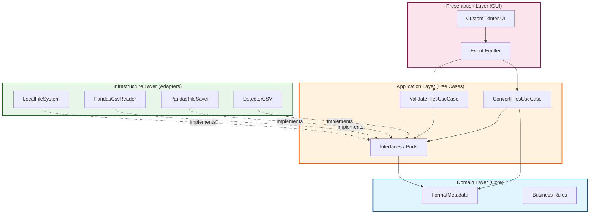

# Conversor Analítico - Enterprise Edition

Sistema de alto desempenho para conversão de arquivos CSV para formatos otimizados de Big Data, construído seguindo os princípios de Clean Architecture e SOLID.

## Visão Geral

Este projeto foi reestruturado para atender a padrões corporativos de escalabilidade, manutenibilidade e segurança. Ele permite a conversão de grandes volumes de dados CSV para formatos como Parquet, Feather, ORC e HDF5, com suporte a processamento em chunks para otimização de memória RAM.

## Arquitetura

O projeto segue a Clean Architecture Clássica, garantindo baixo acoplamento e alta coesão:



- **Domain**: Regras de negócio essenciais e entidades independentes de frameworks.
- **Application**: Casos de uso que orquestram a lógica da aplicação e interfaces (portas).
- **Infrastructure**: Implementações técnicas (adaptadores) para acesso a arquivos, persistência e detecção de dados.
- **Presentation**: Interface gráfica (GUI) construída com CustomTkinter, utilizando mensageria assíncrona para operações thread-safe.

## Tecnologias

- Python 3.10+
- Pandas (Processamento de dados)
- PyArrow (Mecanismo de Big Data)
- CustomTkinter (Interface Moderna)
- Ruff/Mypy/Black (Qualidade de Código)

## Instalação

1. Certifique-se de ter o Python instalado.
2. Instale as dependências:
   ```bash
   pip install -r requirements.txt
   ```

## Execução

Inicie a aplicação através do ponto de entrada principal:
```bash
python main.py
```

## Qualidade de Código

O projeto utiliza ferramentas modernas para garantir a integridade do código:
- **Linting**: Ruff
- **Type Checking**: Mypy
- **Formatting**: Black

As configurações estão centralizadas no arquivo `pyproject.toml`.
