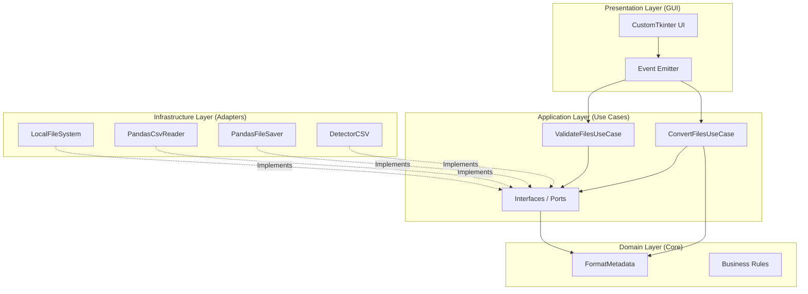

# Analytical Converter - Enterprise Edition

High-performance data conversion platform designed for transforming CSV datasets into optimized Big Data formats using a Clean Architecture approach and SOLID principles.

The system was engineered for scalability, maintainability and memory-efficient processing of large datasets.

---

# Overview

This project provides a structured data processing platform capable of converting large CSV files into analytical storage formats such as:

- Parquet
- Feather
- ORC
- HDF5

The application includes chunk-based processing strategies to reduce memory consumption and improve runtime efficiency when handling large-scale datasets.

The architecture follows enterprise engineering standards with strong separation between business rules, use cases, infrastructure and presentation layers.

---

# Clean Architecture



---

# Architecture Layers

## Domain Layer

Contains:

- Core business rules
- Domain entities
- Framework-independent logic
- Validation policies

## Application Layer

Responsible for:

- Use case orchestration
- Business workflow coordination
- Interface contracts (ports)
- Conversion pipelines

## Infrastructure Layer

Implements:

- File system access
- CSV readers
- Data persistence adapters
- Format detection services

## Presentation Layer

Provides:

- Desktop graphical interface
- Asynchronous event communication
- Thread-safe UI operations
- Runtime feedback visualization

---

# Core Features

- CSV conversion to Big Data formats
- Chunk-based memory optimization
- High-volume dataset processing
- Clean Architecture implementation
- Asynchronous processing workflows
- Thread-safe desktop operations
- Extensible conversion pipelines
- Modular adapter-based infrastructure
- Type-safe engineering standards

---

# Supported Formats

| Input | Output Formats |
|---|---|
| CSV | Parquet |
| CSV | Feather |
| CSV | ORC |
| CSV | HDF5 |

---

# Technology Stack

| Layer | Technology |
|---|---|
| Language | Python 3.10+ |
| Data Processing | Pandas |
| Big Data Engine | PyArrow |
| Desktop UI | CustomTkinter |
| Linting | Ruff |
| Type Checking | Mypy |
| Formatting | Black |

---

# Performance Strategies

The platform includes several runtime optimization mechanisms:

- Chunk-based file reading
- Reduced memory allocation
- Efficient serialization pipelines
- Adapter isolation for extensibility
- Asynchronous processing workflows
- Low-coupling architecture design

---

# Installation

## Install dependencies

```bash
pip install -r requirements.txt
```

---

# Run Application

```bash
python main.py
```

---

# Code Quality

The project uses modern engineering tooling to ensure code reliability and maintainability.

| Tool | Purpose |
|---|---|
| Ruff | Linting |
| Mypy | Static type checking |
| Black | Code formatting |

All tooling configuration is centralized in:

```text
pyproject.toml
```

---

# Engineering Principles

- Clean Architecture
- SOLID Principles
- Dependency Inversion
- Separation of Concerns (SoC)
- High Cohesion / Low Coupling
- Modular Infrastructure
- Scalable Data Pipelines
- Enterprise-Oriented Design

---

# Use Cases

- Big Data preprocessing
- Analytical dataset optimization
- ETL workflows
- Data lake preparation
- CSV normalization pipelines
- Batch conversion systems

---

# Future Improvements

Potential roadmap enhancements:

- Distributed processing support
- Multi-threaded conversion engine
- Cloud storage integration
- Streaming-based ingestion
- Apache Spark interoperability
- Schema inference optimization

---

# License

This project is available under the MIT License.
